# 🏫 Desarrollo Web Integrado 2024 — Control de Matrículas de Colegio

Este repositorio contiene los proyectos desarrollados durante el curso **Desarrollo Web Integrado**, perteneciente al sexto ciclo de **Ingeniería de Sistemas e Informática (2024)**.  
Cada entrega representa una evolución del sistema de **control de matrículas** para colegios de educación primaria en el Perú, aplicando diferentes tecnologías y arquitecturas vistas a lo largo del curso.

---


Cada carpeta contiene el código fuente, recursos estáticos, y archivos de configuración correspondientes a cada fase del curso.

---

## 🧩 Entregas y Tecnologías

### 📝 **Entrega 1 — Arquitectura Java y Tecnologías Web**
**Temas:** Java SE, Servlets, JSP, HTML5, CSS3, JDBC  
**Tecnologías utilizadas:**
- Java EE (Servlets, JSP)
- HTML5 / CSS3 / JS
- MySQL
- GlassFish Server
- Maven

**Descripción:**  
Primera versión del sistema de matrícula escolar. Permite registrar y listar alumnos, gestionando la conexión a base de datos mediante JDBC y DAOs.

📸 *Interfaz de usuario:*

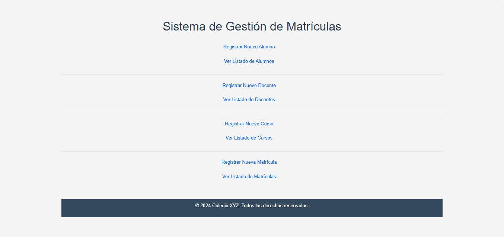


🗄️ *Diagrama base de datos:*
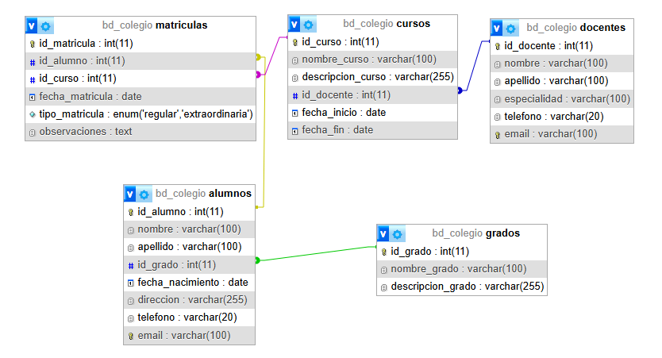

---

### 🧠 **Entrega 2 — Aplicaciones Web y Patrones de Diseño**
**Temas:** MVC, DAO, DTO, JSTL, EL  
**Tecnologías utilizadas:**
- Java EE (Servlets, JSP, JSTL, EL)
- MVC Pattern
- DAO y DTO
- MySQL
- Bootstrap

**Descripción:**  
Segunda versión con una arquitectura basada en el patrón **MVC**. Se incorporan **JSTL** y **Expression Language** para separar la lógica del negocio de la vista.

📸 *Interfaz de usuario:*
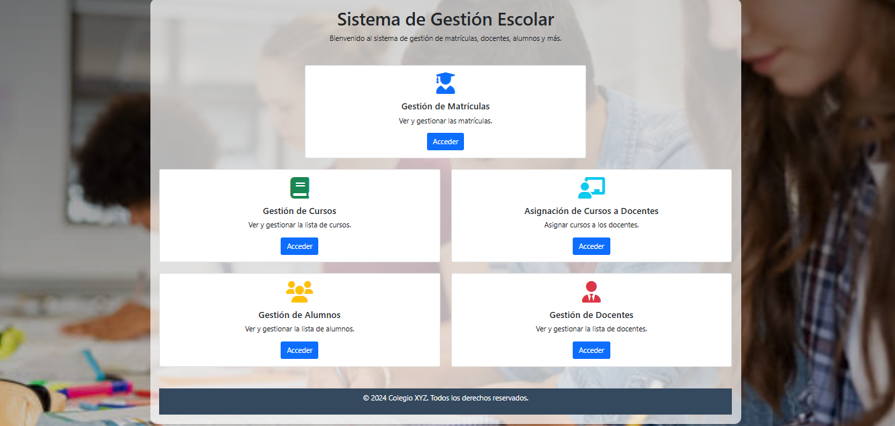
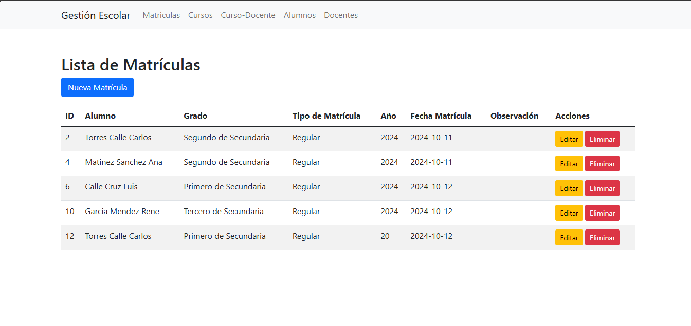

🗄️ *Diagrama base de datos:*
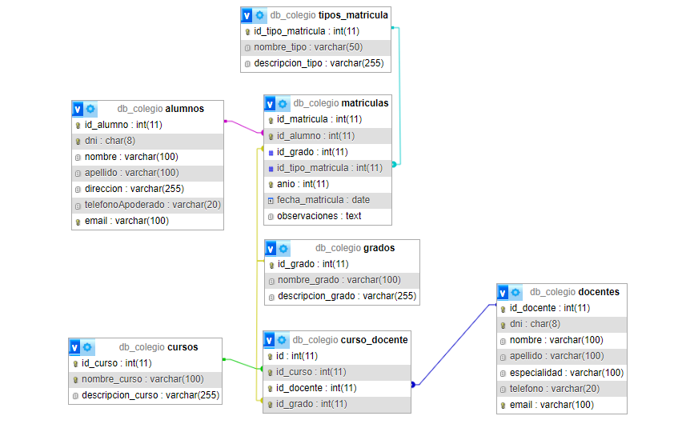

---

### 🌐 **Entrega 3 — Frameworks Web y RESTful APIs**
**Temas:** JSF, Managed Beans, Facelets, BootFaces, RESTful APIs  
**Tecnologías utilizadas:**
- JavaServer Faces (JSF)
- BootFaces (integración con Bootstrap)
- Managed Beans
- RESTful API con JSON
- MySQL
- Maven

**Descripción:**  
Versión final del proyecto integrando **JSF** y **RESTful APIs**.  
Incluye un frontend dinámico y moderno con BootFaces y la implementación de endpoints REST para operaciones CRUD.

📸 *Interfaz de usuario:*
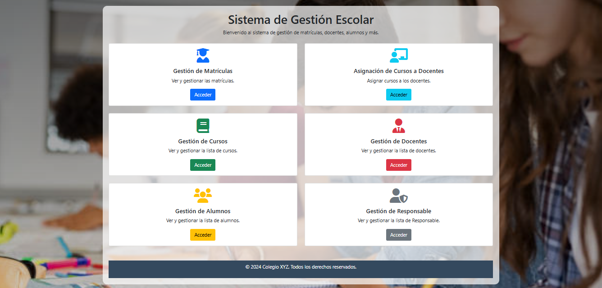
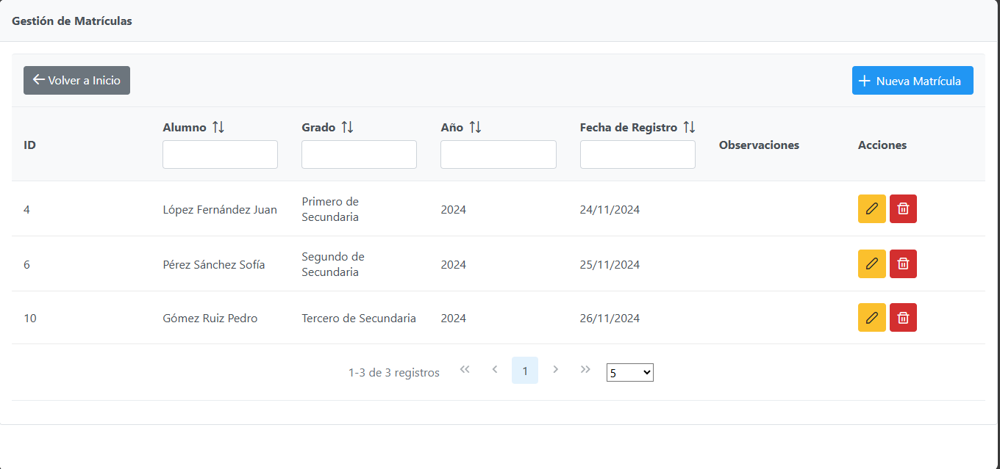
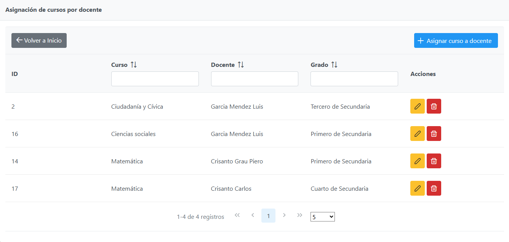
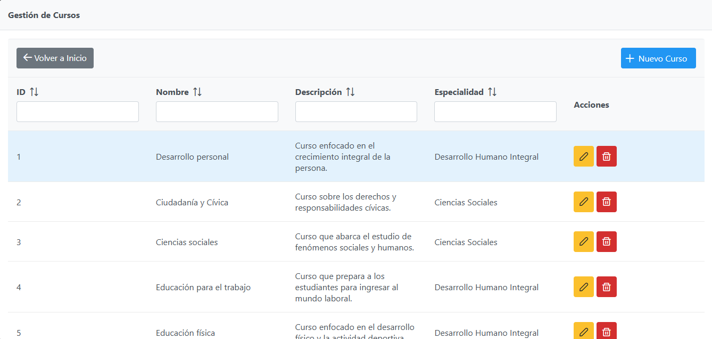
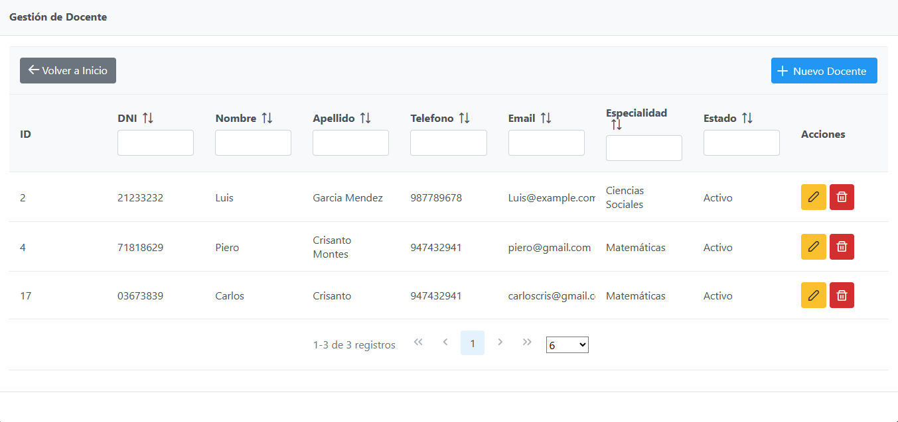
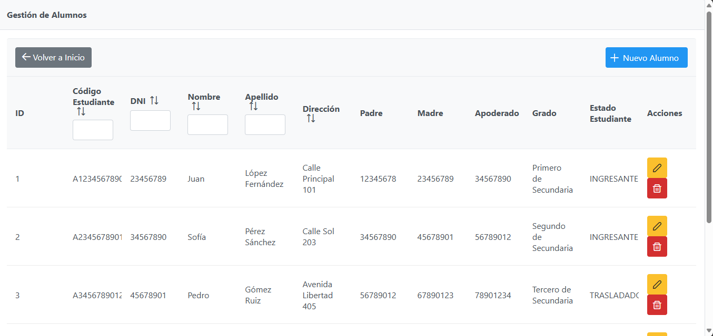
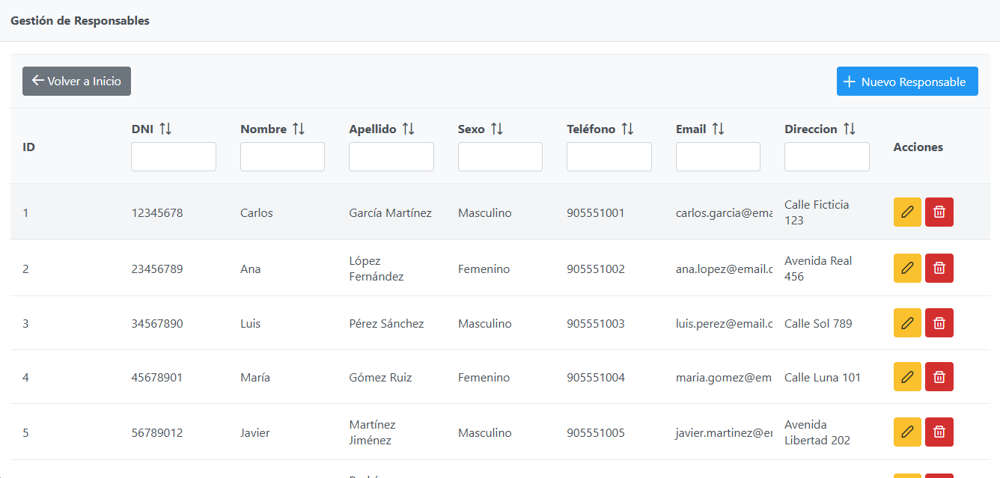

🗄️ *Diagrama base de datos:*
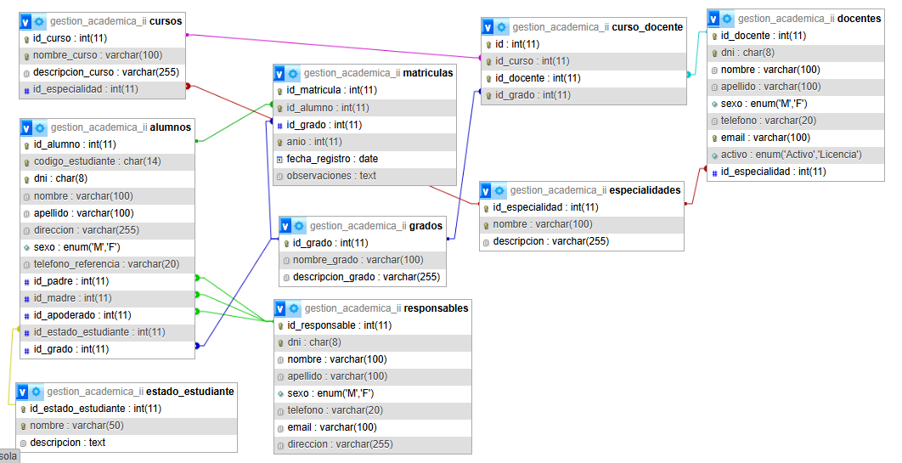

---

## 🗄️ Base de datos

La base de datos se encuentra en el directorio `/database`.  
El sistema utiliza **MySQL**, y las credenciales deben configurarse en un archivo `.env` con el siguiente formato:

```env
DB_HOST=localhost
DB_PORT=3306
DB_NAME=colegio_db
DB_USER=usuario
DB_PASSWORD=contraseña
